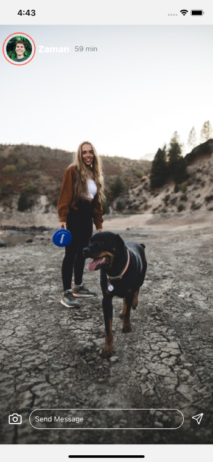
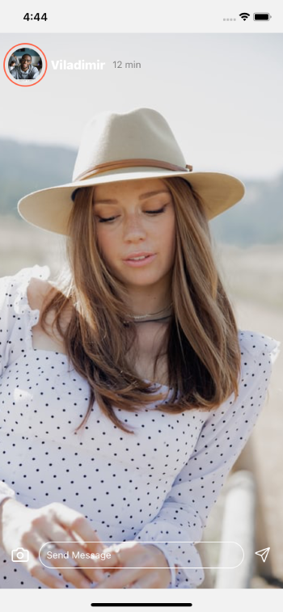

# react-native-instagram-clone

react native instagram clone 🔥

## Note

This project is not completed yet! I shall resume working on back-end once i am ready with AWS account activation.

## Roadmap

- **Front-End** - Completed
  - **Home Screen** - consists of components such as `Story List`, `Post List`
    - Each component is broken down to its sub component to be re-usable in entire app, wherever required
  - **Story Screen** - consists of list of all users stories scrollable
- **Back-End** - Yet not started due to my credit card issue, once resolved, will develop back-end with AWS amplify
  - **Authentication** - we will have authentication
  - **Post Creation** - we will have real-time database post creation component, which is ready for integration
  - **Story Creation** - we will implement Story creation component with back-end

## Screens

During the front-end part, arbitrary/temporary images are taken from web, which shall be replaced by real images generated by users.

